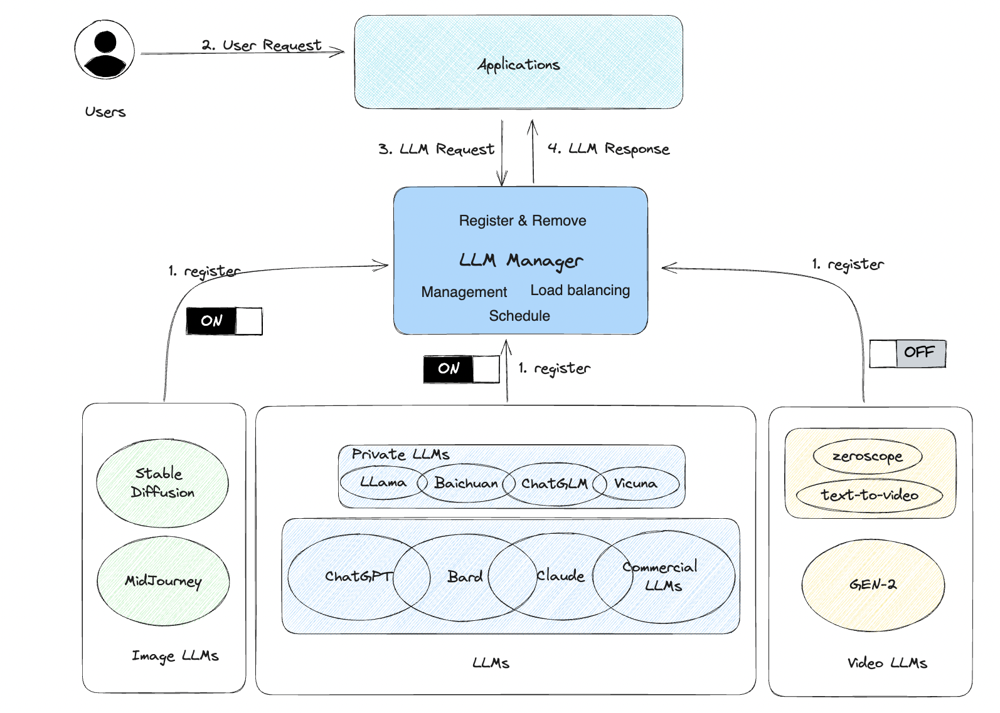

# Multi-model management


## 1. Why do we need multi-model management?
In the era of flourishing LLMs (Large Language Models), a large number of models have emerged. These models include not only large language models, but also various image generation models, video generation models, and even multimodal models. In a project, it is unlikely to have just one type of model, let alone only one model. It is more likely to have complex combinations such as x LLM_A models, y LLM_B models, and z LLM_C models. In real-world business scenarios, there will be a multitude of problems to be solved.
- How to implement multiple model scheduling?
- How to achieve load balancing?
- How to manage the health of inference services?
- How to quickly integrate third-party models?
- How to achieve fast sharing of models without the need for adaptation?
- How to...

The emergence of multi-model management is driven by a multitude of scenarios and demands.


## 2. Architecture

### 2.1 Current status of multi-models

- Currently, the better private large language models include the Llama series, ChatGLM series, and Baichuan series. As for commercial large models such as ChatGPT, Bard, and Claude, the inference cost is lower than that of privately deployed models and far superior to privately deployed models. Users can also access them in a lightweight manner through proxies.


- Currently, there are some image models that perform well, such as the commercial model Midjourney and the open-source model StableDiffusion. The latest StableDiffusion model has parameters of nearly 50GB and supports inference on 8GB GPUs, although CPU inference is slower.


- Currently, the commercial model Gen-2 performs well in video modeling. Other open-source video models have relatively poor performance. With the high attention given to multimodal models, progress is being made rapidly, and the performance is continuously improving.

### 2.2 Characteristics of large AI models

Deploying private inference services can be costly, often requiring dozens of gigabytes of memory and GPU memory. Multi-model deployment is typically managed through service APIs, and commercial large models are also accessed through APIs. Therefore, it is entirely feasible to build a multi-model management system based on inference service APIs.

### 2.3 Multi-model management architecture



## 3. Multi-model management API

### 3.1 Model Registration
- Model registration requires registering the API with the LLM framework service for management. The key parameters in the registration need to be selectively replaced, usually only requiring the replacement of {USER_PROMPT}.

```
response_extract: Use the form response["a"]["b"][0]["c"] to extract values from the response.
owner is the owner of the model.
req_url_template is the URL template for the inference service.
model_name is the name of the model. If there are multiple models with the same name, they will be called in a load-balanced manner.
body is the request body.
When registering a model, you need to modify some parameters of the model request to the corresponding values of the following enumeration class. {USER_PROMPT} is a required mapping, while others are optional:
    USER_PROMPT = "{USER_PROMPT}"
    MODEL_TEMPERATURE = "{MODEL_TEMPERATURE}"
    MODEL_NAME = "{MODEL_NAME}"
```

Example: Registering an Inference Service for a Large Model with the Model Manager:
```

# Initiate Registration Request
curl -X POST -H "Content-Type: application/json" -d '{
    "model_name": "proxyllm",
    "body": {
        "input": "{USER_PROMPT}",
        "model_name": "{MODEL_NAME}"
    },
    "req_url_template": "http://127.0.0.1/api/generate",
    "owner": "operategpt",
    "response_extract": "data.items[].attributes.answer"
}' http://127.0.0.1:8007/api/server/register


# Return Result
{
    "success": true,
    "msg": "register LLM proxyllm succeed!"
}
```


### 3.2 Query models

```

# 查询请求
curl http://127.0.0.1:8007/api/server/workers

# Return Result

{
    "success": true,
    "data": [
    	{"model_name": "chatglm2-6b", "req_url_template": "https://xxx/openapi/xxx/inference/query"}, 
    	{"model_name": "proxyllm", "req_url_template": "http://localhost:8008/generate"}
    ]
}
```


### 3.3 Offline Model

```

# Initiate Offline Request
curl -X POST -H "Content-Type: application/json" -d '{
    "model_name": "chatglm2-6b",
    "req_url_template": "https://xxx/openapi/xxx/inference/query"
}' http://127.0.0.1:8007/api/server/offline


# Return Result
{
    "success": true,
    "msg": "remove llm worker(model_name=chatglm2-6b, url=https://xxx/openapi/xxx/inference/query) succeed!"
}
```


### 3.4 Model Inference

```

# Model Request1
curl -X POST -H "Content-Type: application/json" -d '{
    "input": "who are you?",
    "model_name": "chatglm2-6b"
}' http://127.0.0.1:8007/api/v1/chat/completions

# Return Result1
{
    "success": true,
    "msg": "execute succeed",
    "result": "Hey there! My name is Noxix, and I am an AI chatbot designed to have conversations with users like you. How can I assist you today?"
}

# Model Request2
curl -X POST -H "Content-Type: application/json" -d '{
    "input": "who are you?",
    "model_name": "proxyllm"
}' http://127.0.0.1:8007/api/v1/chat/completions

# Return Result2
{
    "success": true,
    "msg": "execute succeed",
    "result": "I am an AI language model developed by OpenAI. I am programmed to provide information and assist with various tasks. How can I help you today?"
}
```

## 4. Code

For More Detail: [Multi-Model Management](https://github.com/xuyuan23/operateGPT/tree/master/operategpt/llms)
